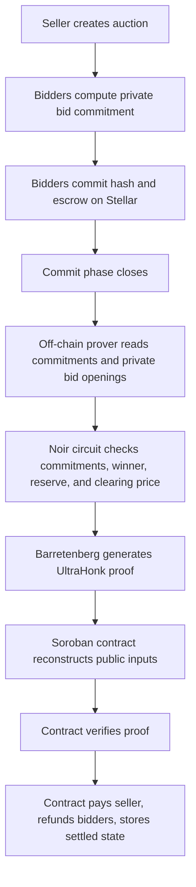
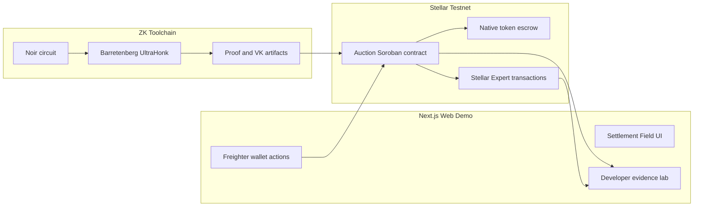

# zkAuction

Private sealed-bid auctions with zero-knowledge settlement on Stellar.

zkAuction combines a Soroban smart contract, a Noir UltraHonk circuit, a Barretenberg proof pipeline, token escrow, and a judge/developer-focused web demo. Bidders commit sealed bids on-chain, the commit phase closes, a real ZK proof proves the settlement result, and the deployed contract finalizes the winner, refunds, seller payment, and clearing price on Stellar testnet.

## Status

| Area | Status | Evidence |
| --- | --- | --- |
| Soroban contract | Deployed on Stellar testnet | `CAKDGU5BFBHR675MJEEA6UQOJ2RL342D5LGU4FYTDGLI4LL4I7UFLSV6` |
| Full settlement E2E | Passed | Auction `1` settled with real Noir/Barretenberg proof |
| Token escrow settlement | Passed | Seller paid `70`, winner refunded `30`, losers refunded `100` each |
| Contract escrow balance | Passed | Final native-asset balance is `0` |
| Web demo | Local production build passed | `web` Next.js app, evidence lab, Freighter flow |
| Public deployment | Not performed in this branch | No push and no public redeploy performed |

## Live Testnet Evidence

- Network: Stellar Testnet
- RPC: `https://soroban-testnet.stellar.org`
- Contract: `CAKDGU5BFBHR675MJEEA6UQOJ2RL342D5LGU4FYTDGLI4LL4I7UFLSV6`
- Contract explorer: `https://stellar.expert/explorer/testnet/contract/CAKDGU5BFBHR675MJEEA6UQOJ2RL342D5LGU4FYTDGLI4LL4I7UFLSV6`
- Verified auction ID: `1`
- Settlement transaction: `48e7da6972244096ce0193007d1dbaaf97c80f985314f1cb762365460792865d`
- Proof SHA-256: `7ae60f32d9df8a596db541c731f92690823e23ab0b2bff5485b45098296d500d`
- Verification key SHA-256: `e42da8f83e29e7ff858d2556c90ea8e400bf345c59c8d4eafc75470b77610b69`

Final verified auction state:

```json
{
  "id": 1,
  "status": "Settled",
  "bidder_count": 3,
  "winner": "GB3GWNT5ILVYVA5TNSALZY774TFVDQBQG2JTTPGQV6UBMYXGGVDHHN2W",
  "clearing_price": 70,
  "reserve_price": 10,
  "second_price": true,
  "contract_token_balance_after_settlement": "0"
}
```

## Product Workflow



## System Architecture



## Repository Structure

```text
zkauction/
|-- circuits/
|   `-- auction_settle/
|       |-- src/main.nr            # Noir settlement circuit
|       |-- Prover.toml            # E2E witness input
|       `-- target/                # VK/proof/public input artifacts
|-- contracts/
|   `-- auction/
|       |-- src/                   # Soroban auction contract and tests
|       `-- Cargo.toml
|-- packages/
|   `-- auction-bindings/          # Generated contract bindings package
|-- scripts/
|   |-- deploy_testnet_real.sh     # Deploy current real-proof contract
|   |-- e2e_testnet_settle.sh      # Full create/commit/close/prove/settle flow
|   |-- pack_proof.ts              # Proof packing utility
|   `-- verify-local.ps1           # Local ZK tool verification wrapper
|-- web/
|   |-- src/app/                   # Next.js app shell and global design tokens
|   |-- src/components/            # Hero, demo workspace, evidence lab
|   `-- src/lib/                   # Soroban constants, client helpers, display utils
|-- TESTNET_DEPLOYMENT.md          # Deployment and E2E evidence log
|-- VERIFICATION.md                # Local verification notes
`-- README.md
```

## Core Components

### Soroban Contract

The contract under `contracts/auction` is responsible for:

- Creating auctions with seller, token, reserve price, deadline, and pricing mode.
- Accepting sealed bid commitments with escrow.
- Enforcing auction phase transitions: `Open -> Closed -> Settled`.
- Reconstructing public inputs deterministically from on-chain auction state.
- Verifying the UltraHonk proof.
- Paying the seller and refunding bidders from escrow.
- Storing final winner, clearing price, and settled status.

### Noir Circuit

The circuit under `circuits/auction_settle/src/main.nr` enforces:

- Every private bid and blinding factor opens to the corresponding public commitment.
- The winner index matches the highest valid bid.
- The reserve price is satisfied.
- The clearing price is correct for the configured pricing mode.
- Public inputs match the contract-side reconstruction.

### Web Demo

The `web` app is a Next.js 16 / React 19 demo with:

- Motion-first Settlement Field hero.
- Live settlement receipt read from Stellar testnet.
- Freighter wallet connection.
- Create auction and commit bid flow.
- Developer verification lab with contract ID, transaction trail, proof hash, VK hash, and decoded settled auction state.
- Brand tokens based on the provided GenAI Fund design system: `Space Mono` plus black, white, red, purple, and cyan palette.

## Quick Start

### 1. Install web dependencies

```powershell
cd D:\dorahack\stellar\zkauction\web
npm install
```

### 2. Run the web demo locally

```powershell
npm run dev
```

Open:

```text
http://localhost:3000
```

Production-style local check:

```powershell
$env:NODE_OPTIONS="--max-old-space-size=4096"
npm run build
npx next start -p 3002
```

Open:

```text
http://127.0.0.1:3002
```

### 3. Verify the web build

```powershell
cd D:\dorahack\stellar\zkauction\web
npm run lint
$env:NODE_OPTIONS="--max-old-space-size=4096"
npm run build
```

## ZK and Contract Verification

### Contract tests

```powershell
cd D:\dorahack\stellar\zkauction
cargo test --manifest-path contracts/auction/Cargo.toml
```

### Noir tests and Barretenberg availability

If `nargo` and `bb` are not on the global `PATH`, use the local verification wrapper:

```powershell
powershell -ExecutionPolicy Bypass -File scripts/verify-local.ps1
```

Manual equivalents:

```powershell
.\nargo.bat test --program-dir circuits/auction_settle
.\bb.bat --version
```

### Full testnet E2E

The full testnet flow is scripted for a WSL environment with Stellar CLI, Noir, and Barretenberg available:

```powershell
wsl bash /mnt/d/dorahack/stellar/zkauction/scripts/e2e_testnet_settle.sh
```

Deploy current real-proof contract:

```powershell
wsl bash /mnt/d/dorahack/stellar/zkauction/scripts/deploy_testnet_real.sh
```

## Detailed On-Chain Workflow

### 1. Create Auction

The seller creates an auction with:

- Seller address.
- Escrow token contract.
- Reserve price.
- Deadline.
- Pricing mode: first-price or second-price.

### 2. Commit Bid

Each bidder:

- Computes a private commitment from bid amount and blinding factor.
- Submits the commitment hash to the contract.
- Escrows token value into the contract.

### 3. Close Commit Phase

After the deadline, the auction is closed. No new commitments are accepted.

### 4. Generate Proof

The prover:

- Reads public auction configuration and commitments.
- Uses private bid openings and blinding factors.
- Generates a Noir witness.
- Creates an UltraHonk proof with Barretenberg.

### 5. Settle On-Chain

The contract:

- Reconstructs public inputs from auction state.
- Verifies the proof.
- Stores winner and clearing price.
- Pays seller.
- Refunds winner change and losing bidders.
- Leaves escrow balance at zero.

## Transaction Trail for Auction 1

| Step | Transaction |
| --- | --- |
| Deploy contract | `be172f8cd502429c0c747fc8844c556b21e6c30ca7bbea8d921a0bf7f9dc042a` |
| Create auction | `336eaa1995148ab931a442d833c443edf2ce40002279c3796c696358a28089e5` |
| Commit bidder 1 | `c3ed14555da0195c674f51ca50c72486245d02dc69cc5dbb70a2956935d9e634` |
| Commit bidder 2 | `79fa69c042136ad6ed2ae8d3bfafddd46d3bf4419aaeee0c452d809d9a7fc031` |
| Commit bidder 3 | `74267b1ce16100a0b694ab646291da87646a3272837427354a4ee0797f346388` |
| Close phase | `ce0cb4641efadd8e0bb744b1733727b10f99ee19c4c6dfbb023654839ef61d57` |
| Settle proof | `48e7da6972244096ce0193007d1dbaaf97c80f985314f1cb762365460792865d` |

Settlement transfers:

| Recipient | Amount |
| --- | ---: |
| Seller payment | `70` |
| Winner refund/change | `30` |
| Loser bidder 1 refund | `100` |
| Loser bidder 3 refund | `100` |

## Design System

The web UI uses the provided design reference:

- Font: `Space Mono`, fallback `ui-sans-serif`.
- Primary palette:
  - `#0A0A0A` background.
  - `#FFFFFF` foreground.
  - `#E9301C` red accent.
  - `#AA60E6` purple accent.
  - `#00FFFF` cyan proof/verified accent.
- Token-driven CSS in `web/src/app/globals.css`.

## Security and Privacy Boundaries

Private:

- Raw bid amounts.
- Blinding factors.
- Witness inputs used to generate the proof.

Public:

- Auction configuration.
- Commitments.
- Winner address.
- Clearing price.
- Proof and public inputs.
- Settlement transaction trail.

Important properties:

- The contract does not trust browser UI claims.
- The contract reconstructs public inputs before verification.
- Settlement is accepted only after proof verification.
- Token escrow settlement happens inside the contract after proof validation.

## Current Local Verification Snapshot

Latest local checks performed after the UI redesign:

```text
npm run lint                                  PASS
NODE_OPTIONS=--max-old-space-size=4096 npm run build  PASS
Browser smoke at 390x844                     PASS
Browser smoke at 1440x900                    PASS
Evidence lab values                          PASS
```

Browser evidence confirmed:

- `Space Mono` active.
- Design palette tokens active.
- No mobile horizontal overflow.
- Hero and receipt visible.
- Evidence lab displays auction `1`, `Settled`, bidder count `3`, clearing price `70`, winner `GB3G...`, proof hash, VK hash, contract ID, and settlement transaction.

## Notes

- No Git push was performed by Codex during the redesign.
- No public Vercel deployment was performed after the redesign.
- The public URL, if any, may not reflect the latest local UI until a new deployment is explicitly run.
- `TESTNET_DEPLOYMENT.md` is the detailed deployment evidence source of truth.
- `VERIFICATION.md` explains local ZK tool wrapper usage.
